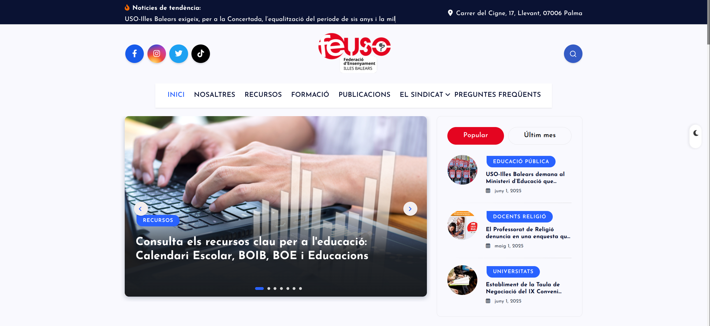
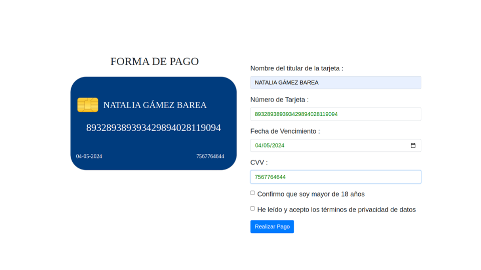

<table align="center">
  <tr>
    <td width="50%">
      <h3 align="center">Proyecto Feuso</h3>
      

        
        

           
          
        

        
Desarrollamos entre cuatro personas una web sindical para profesionales de la educación en Baleares utilizando Wordpress, que ofrece noticias, formación, acceso al BOIB y recursos clave, todo de forma accesible y actualizada.

      

    </td>
    <td width="50%">
      <h3 align="center">Utilización API de Wordpress</h3>
      

        
        

          
        

        
He desarrollado una conexión entre JavaScript, HTML y WordPress mediante la API REST, utilizando IDs para identificar y sincronizar datos específicos. Permite que cualquier cambio en el contenido de WordPress se refleje automáticamente en la página HTML.

      

    </td>
  </tr>
  <tr>
    <td width="50%">
      <h3 align="center">Tarjeta de crédito con Sheets</h3>
      

        
        

          
          
        

        
Desarrollé una aplicación en Google Sheets que permite a los usuarios registrarse e iniciar sesión. Este formulario muestra una tarjeta en tiempo real y almacena la información en hojas de Google Sheets. Permite que cambios en los datos de los usuarios se reflejen.

      

    </td>
    <td width="50%">
      <h3 align="center">Gestión de Usuarios</h3>
      

        
        

          
        

        
He desarrollado una aplicación con Electron para el frontend y un backend completo utilizando Node.js y Express, implementando todas las operaciones CRUD para el manejo de datos de usuarios.

      

    </td>
  </tr>
  <tr>
    <td width="50%">
      <h3 align="center">Python Visual</h3>
      

        
        

          
        

        
He utilizado Python Visual para crear una calculadora de amor, un divertido juego de dados, una interactiva aplicación web y una potente app empresarial, cada una con interfaces intuitivas.

      

    </td>
    <td width="50%">
      <h3 align="center">Amazon Clone</h3>
      

        
        

          
          
        

        
Desarrollé una interfaz de usuario para una réplica de Amazon utilizando HTML, CSS y JavaScript. Este proyecto solo incluye el frontend y no es responsive.

      

    </td>
  </tr>
  <tr>
    <td width="50%">
      <h3 align="center">Spotify Clone</h3>
      

        
        

          
          
        

        
Implementé una interfaz similar a la de Spotify usando HTML y CSS puro. Este proyecto se centra en la estética visual y no es responsive.

      

    </td>
    <td width="50%">
      <h3 align="center">ANTIX</h3>
      

        
        

          
          
        

        
Mi primera página web fue una página web que su objetivo era enseñar dinámicamente de forma divertida los comandos de linux.

      

    </td>
  </tr>
</table>
